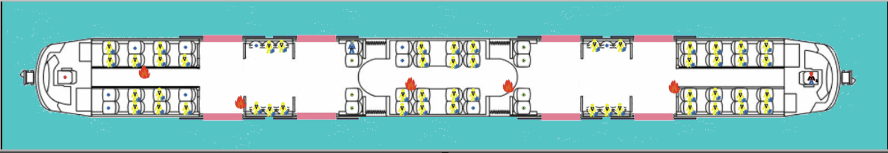
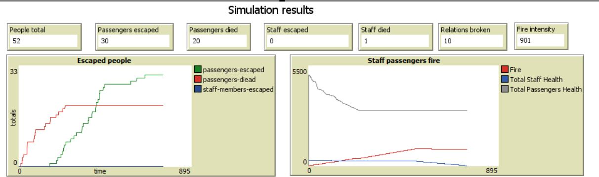
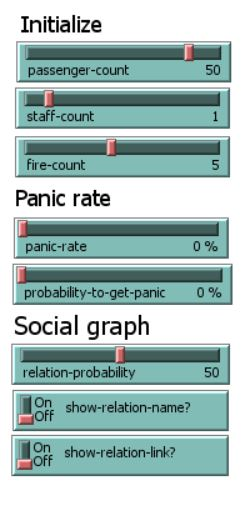

# Train evacuation model using NetLogo
## Purpose
The proposed model simulates people evacuating from a train in case of fire and explores the results of different evacuation strategies. This model is composed of the driver driving the train, passengers travelling in the train and the staff members where all of them represent the agents. The model can generate several results within a few seconds.
In case of fire in real world, the staff members tend to be calm and try to stop the fire in the train and then provide support to passengers. Passengers either escaped by themselves, follow staff instructions quietly using the closest safe path or might get panic and delay their evacuation. 
This model helps to analyze the phenomenon of evacuation in case of a fire in the train. The behavior of passengers and staff in addition to fire intensity determine how this phenomenon evolves over time and space. 

## Sample Simulation 

## Sample Simulation Results

## Interface paramters

